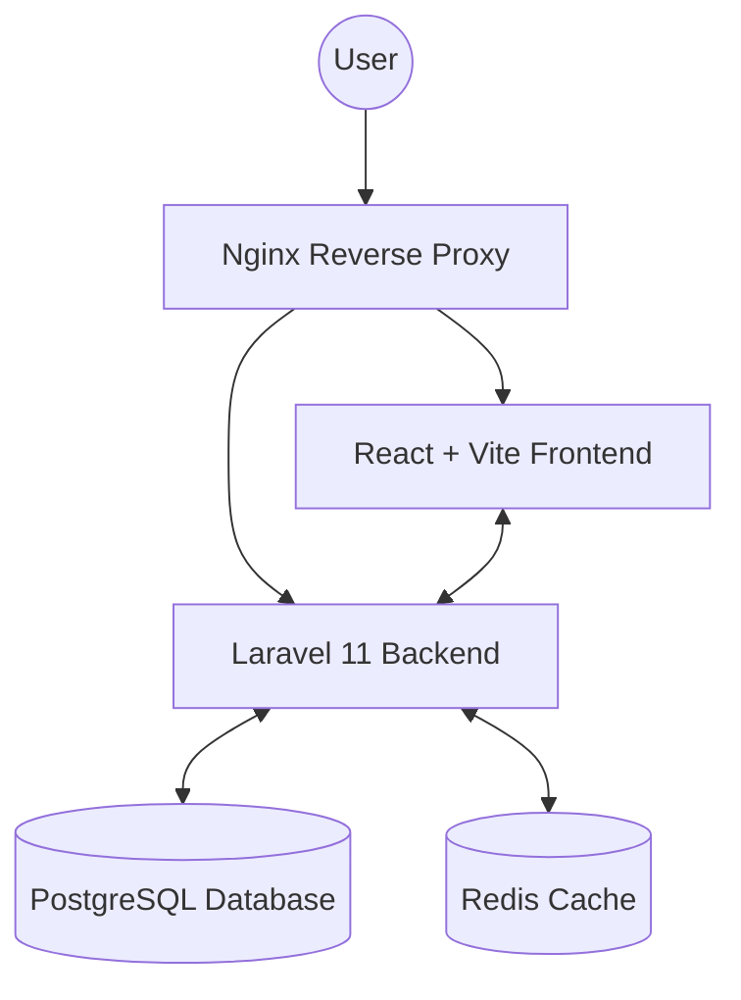
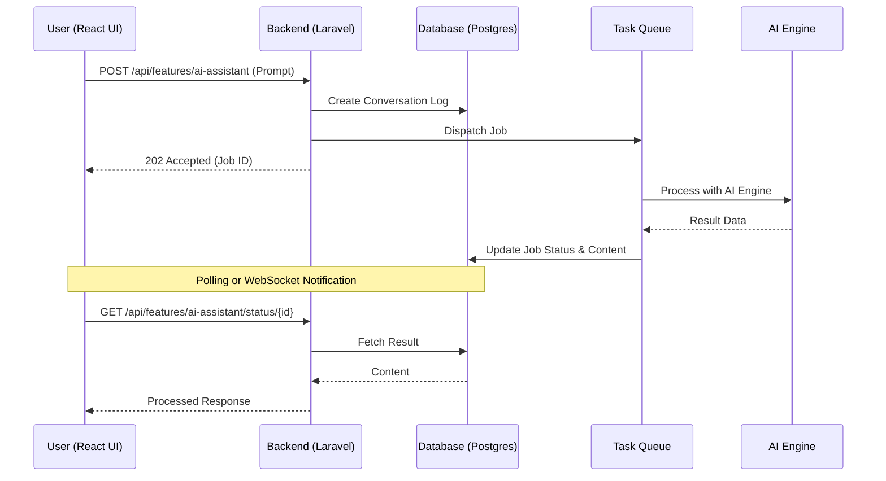

# CND Upraze Solutions

CND Upraze Solutions is a comprehensive SaaS platform designed to empower businesses with intelligent tools for AI assistance, data forecasting, 3D manipulation, and more. Our mission is to create smart, scalable systems that adapt to the evolving needs of modern industries.

## System Architecture

Our system is built using a modern micro-monolith approach, containerized with Docker for seamless deployment and scalability.



## Data Pipeline (AI Query Flow)

The following diagram illustrates how an asynchronous AI query or task is handled within the CND Upraze ecosystem.



## Tech Stack

- **Frontend**: React 18, Vite, Tailwind CSS 4.0, Framer Motion, Lucide Icons.
- **Backend**: Laravel 11, PHP 8.3, Sanctum (Stateful Authentication).
- **Database**: PostgreSQL 16.
- **Infrastructure**: Docker, Nginx, CI/CD via GitHub Actions.

## Getting Started

### Prerequisites
- Docker & Docker Compose
- Git

### Installation

1. **Clone the repository**:
   ```bash
   git clone https://github.com/binssente-crypto/CND-Upraze.git
   cd CND-Upraze
   ```

2. **Run with Docker**:
   ```bash
   docker compose up -d --build
   ```

3. **Initialize Database**:
   ```bash
   docker compose exec backend php artisan migrate --seed
   ```

The application will be available at:
- **Frontend**: [http://localhost:5173](http://localhost:5173)
- **Backend API**: [http://localhost:8000](http://localhost:8000)

## Core Modules
- **AI ASSISTANCE**: Task automation and intelligent decision support.
- **FORECASTING**: Predictive analytics and trend modeling.
- **3D MANIPULATION**: Interactive 3D model viewing and editing.
- **IMAGE RECOGNITION**: AI-driven visual data extraction.
- **QR CODE ACCESS**: Fast, proprietary access and activity tracking.

---
© 2026 CND UPRAZE SOLUTIONS. ALL RIGHTS RESERVED.
