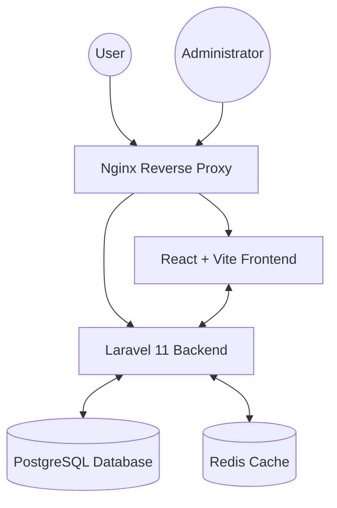
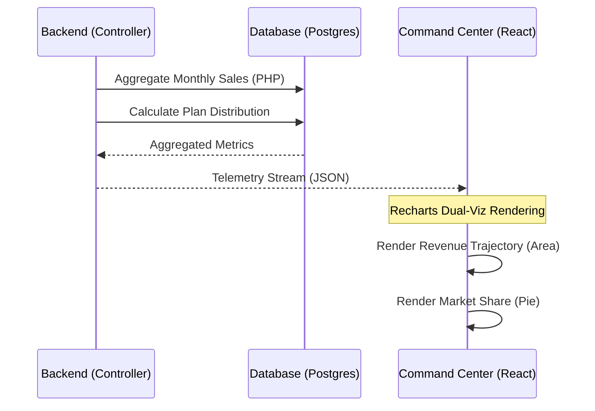
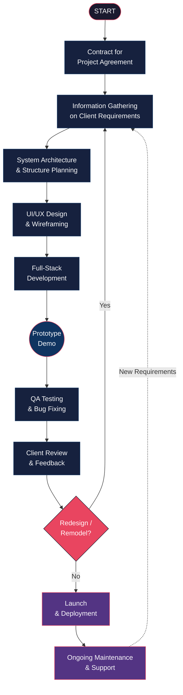
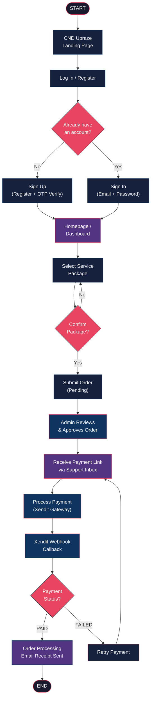

# CND Upraze Solutions

CND Upraze Solutions is a comprehensive SaaS platform designed to empower businesses with intelligent tools for AI assistance, data forecasting, and more. Our mission is to create smart, scalable systems that adapt to the evolving needs of modern industries.

## System Architecture

Our system is built using a modern micro-monolith approach, containerized with Docker for seamless deployment and scalability.



## Administrative Governance (Command Center)

The following diagram illustrates the flow of high-fidelity telemetry and market share data into the administrative command center.



## Development Process Flowchart

The following diagram illustrates the end-to-end development lifecycle used by CND Upraze Solutions — from initial client engagement through deployment and ongoing maintenance.



## Transaction Process Flowchart

The following diagram illustrates the complete user transaction flow — from initial visit on the CND Upraze landing page through authentication, package selection, payment processing via Xendit, and order fulfillment.



## Navigation Process Flowchart

The following diagram illustrates the complete navigation process within the CND Upraze platform — from user registration through service selection, order placement, admin confirmation, and payment completion.

```mermaid
flowchart TD
    START(["Start"]) --> REGISTER["Register"]
    REGISTER --> NEW_USER{"New User?"}
    NEW_USER -- "Yes" --> SIGNUP["Sign-Up\n(OTP Verification)"]
    NEW_USER -- "No" --> SIGNIN
    SIGNUP --> SIGNIN["Sign-In"]
    SIGNIN --> DASHBOARD["Dashboard"]
    DASHBOARD --> PRODUCTS["Service Packages\n(Billing Page)"]
    PRODUCTS --> CHOOSE["Choosing of\nService Plan"]
    CHOOSE --> FILL_DETAILS["Fill Up Company\n& Order Details"]
    FILL_DETAILS --> WAIT_ADMIN["Wait for Admin\nConfirmation"]
    WAIT_ADMIN --> SUPPORT_MSG["Receive Payment Link\nvia Support Inbox"]
    SUPPORT_MSG --> CHECKOUT["Checkout\n(Xendit Payment)"]
    CHECKOUT --> RECEIPT["Send Email\nReceipt"]
    RECEIPT --> UPDATE["Update Order Status\nto Processing"]
    UPDATE --> FINISH(["End"])

    style START fill:#1a1a2e,stroke:#e94560,color:#fff
    style REGISTER fill:#16213e,stroke:#0f3460,color:#fff
    style NEW_USER fill:#e94560,stroke:#1a1a2e,color:#fff
    style SIGNUP fill:#16213e,stroke:#0f3460,color:#fff
    style SIGNIN fill:#16213e,stroke:#0f3460,color:#fff
    style DASHBOARD fill:#533483,stroke:#e94560,color:#fff
    style PRODUCTS fill:#16213e,stroke:#0f3460,color:#fff
    style CHOOSE fill:#16213e,stroke:#0f3460,color:#fff
    style FILL_DETAILS fill:#16213e,stroke:#0f3460,color:#fff
    style WAIT_ADMIN fill:#0f3460,stroke:#e94560,color:#fff
    style SUPPORT_MSG fill:#533483,stroke:#e94560,color:#fff
    style CHECKOUT fill:#0f3460,stroke:#e94560,color:#fff
    style RECEIPT fill:#533483,stroke:#e94560,color:#fff
    style UPDATE fill:#533483,stroke:#e94560,color:#fff
    style FINISH fill:#1a1a2e,stroke:#e94560,color:#fff
```



## Recent Feature Implementations (May 2026)

### Administrative Command Center
A high-fidelity cockpit for platform governance:
- **Real-Time Telemetry**: Dual-chart visualization for financial trajectories and market share distribution.
- **User Directory**: Streamlined management of clients with high-density data views.
- **Offer Management**: Dynamic creation and deployment of service packages.
- **Security Hardening**: Secure administrative credential management via environment-variable externalization.

### 3D Studio Integration
Expansion of our visual data capabilities:
- **Bento-Style Grid**: Seamless integration of 3D manipulation into the service grid.
- **Protocol Core**: Propelling visual data into 3D space for proprietary business use.

### Support & Inquiry Optimization
Hardened communication infrastructure:
- **Database Indexing**: Strategic indices on unread status and sender tracking for near-instant message retrieval.
- **Field-Level Optimization**: Reduced memory overhead by selecting specific telemetry columns during data fetching.
- **Unified Chat**: Consistent 3D/Support visual language across admin and user views.

### Content Protection & Security
Implementation of strict content security measures:
- **Disabled Copy/Paste**: Global blocking of Ctrl+C and Ctrl+A commands.
- **Text Selection Prevention**: CSS-level select-none implementation across the entire app.
- **Repository Governance**: Integrated branch protection and credential safety protocols.

## Technical Ecosystem

<div align="center">


</div>


| Category | Technology Stack | Implementation & Rationale |
| :--- | :--- | :--- |
| **Frontend Architecture** | **React 19**, **Vite**, **Tailwind 4.0**, **Framer Motion** | React 19 handles interface state. Vite provides fast module replacement. Tailwind CSS 4.0 manages design tokens. Framer Motion runs animations at a strict 0.15s duration for near-zero perceived latency. |
| **Backend Core** | **Laravel 11**, **PHP 8.3**, **Sanctum** | Laravel 11 operates as the Protocol Core for business logic. PHP 8.3 processes backend operations with strict typing. Sanctum manages secure, stateful API authentication. |
| **Data Integrity** | **PostgreSQL 16**, **Recharts** | PostgreSQL 16 stores relational and JSONB data. Recharts visualizes telemetry streams for administrative governance. |
| **Task Queuing** | **Redis 7** | Redis 7 manages background queues for AI tasks and caching, protecting the core from traffic spikes. |
| **Financial Gateway** | **PayMongo** | Processes enterprise subscription payments targeting the Philippines market (GCash, Maya, Bank Transfer). |
| **AI Intelligence** | **Groq AI** | LLM inference on Groq hardware for near-instant interaction speeds. |
| **Infrastructure** | **AWS**, **Docker**, **GitHub Actions** | AWS production hosting, Docker containerization, and automated CI/CD via GitHub Actions for seamless deployment. |

## Getting Started

### Prerequisites
- Docker & Docker Compose
- Git

### Installation

1. **Clone the repository**:
   ```bash
   git clone https://github.com/binssente-crypto/CND-Upraze.git
   cd CND-Upraze
   ```

2. **Prepare Environment**:
   Copy the example environment files and set your admin credentials:
   ```bash
   cp backend/.env.example backend/.env
   # Add ADMIN_EMAIL and ADMIN_PASSWORD to backend/.env
   ```

3. **Run with Docker**:
   ```bash
   docker compose up -d --build
   ```

4. **Initialize Database**:
   ```bash
   docker compose exec backend php artisan migrate --seed
   ```

## Core Modules
- **PROTOCOL CORE**: Proprietary architectural heart visualized with 3D telemetry.
- **ADMIN COMMAND CENTER**: Real-time platform governance and financial tracking.
- **3D STUDIO**: Specialized visual data manipulation and Bento integration.
- **AI ASSISTANCE**: Near-instant task automation powered by Groq.
- **SUPPORT HUB**: Optimized communication hub with performance-tuned indexing.

---
© 2026 CND UPRAZE SOLUTIONS. ALL RIGHTS RESERVED.
