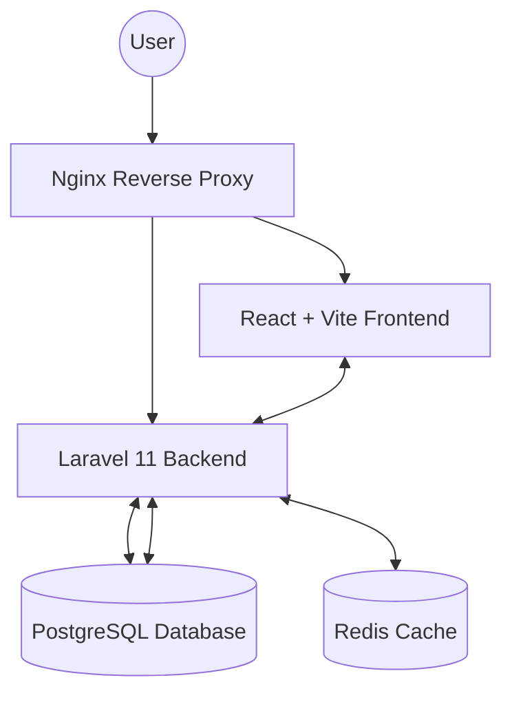
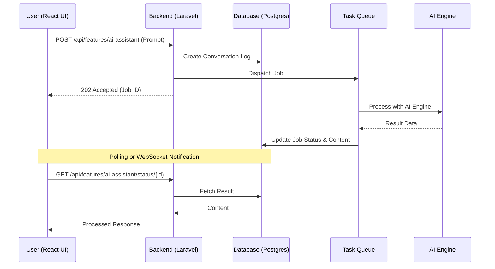

# CND Upraze Solutions

CND Upraze Solutions is a comprehensive SaaS platform designed to empower businesses with intelligent tools for AI assistance, data forecasting, and more. Our mission is to create smart, scalable systems that adapt to the evolving needs of modern industries.

## System Architecture

Our system is built using a modern micro-monolith approach, containerized with Docker for seamless deployment and scalability.



## Data Pipeline (AI Query Flow)

The following diagram illustrates how an asynchronous AI query or task is handled within the CND Upraze ecosystem.



## Recent Feature Implementations (April 2026)

### Support & Inquiry System
A full-featured communication hub for inquiries and customer support:
- **User Support Center**: Allows users to create inquiry tickets and chat directly with support.
- **Admin Support Inbox**: A centralized dashboard for administrators to manage, reply, and track statuses of all customer inquiries.
- **Threaded Conversations**: Uses JSONB message threads for efficient and scalable chat history management.

### Dashboard Modules Hub
A centralized "Central Hub" for all available business modules:
- **Quick Launch**: One-click access to AI Assistant, Forecasting, and specialized business tools.
- **Modern UI**: High-fidelity cards with dynamic hover effects and status indicators.

### Content Protection & Security
Implementation of strict content security measures:
- **Disabled Copy/Paste**: Global blocking of Ctrl+C and Ctrl+A commands.
- **Text Selection Prevention**: CSS-level select-none implementation across the entire app to prevent unauthorized content extraction.
- **Repository Governance**: Integrated CODEOWNERS and branch protection strategies to enforce Pull Request workflows for collaborators.

### Legal Infrastructure
Branded, professional legal pages accessible via ultra-snappy modals:
- **Privacy Policy & Terms of Service**: High-fidelity modals integrated into the landing page footer and registration flow.
- **Snappy UX**: Optimized 0.15s transition speeds for an "instant" feel.

## Technical Ecosystem

<div align="center">


</div>


| Category | Technology Stack | Detailed Implementation & Strategic Role |
| :--- | :--- | :--- |
| **Frontend Architecture** | **React 18**, **Vite**, **Tailwind 4.0** | **The Speed of Thought**: Most web apps feel like wading through molasses. We fixed that. By pinning every **Framer Motion** transition to a brutal **0.15s spring**, the UI stops feeling like "code" and starts feeling like an extension of your hand. No spinners, no lag, just raw speed. |
| **Backend Core** | **Laravel 11**, **PHP 8.3**, **Sanctum** | **Sanity at Scale**: We chose **Laravel 11** because it actually ships. It's the **Protocol Core**. We use **Sanctum** for stateful auth because tokens are a nightmare to manage manually. By enforcing strict **PHP 8.3** types, we stop bugs before they ever reach the user. |
| **Data Integrity** | **PostgreSQL 16**, **JSONB** | **JSON Everywhere**: Relational databases are great, but forcing chat threads into strict schemas is a fool's errand. We use **PostgreSQL 16** with **JSONB** because it gives us the flexibility of NoSQL without the headache of managing two databases. It’s the right tool for the job. |
| **Performance Scaling** | **Redis 7**, **Task Queues** | **Don't Make Users Wait**: If a task takes more than 100ms, it doesn't belong in the request loop. We ship every AI operation off to **Redis** background workers. It keeps the UI snappy while **Redis** handles the heavy lifting, caching, and rate-limiting. |
| **Payment Gateway** | **PayMongo** | **Cash is King**: If people can't pay you, you don't have a business. We integrated **PayMongo** because it's the gold standard for the Philippines. GCash, Maya, local banks—if your users use it, we support it. Real-time webhooks mean subscriptions activate instantly. |
| **AI Intelligence** | **Groq AI** | **AI at the Speed of Light**: Most chatbots feel like talking to a sleepy snail. We use **Groq AI** because it’s fast. Like, scary fast. Near-instant LLM responses mean you're actually having a conversation, not just waiting for a progress bar to finish. |
| **Cloud Infrastructure** | **AWS**, **Docker**, **Nginx**, **GitHub Actions** | **Automate or Die**: Hand-deploying code is a recipe for disaster. We use **GitHub Actions** to push every commit through a gauntlet of tests before it hits our **AWS** clusters. The whole thing is wrapped in **Docker** containers because "it works on my machine" isn't an excuse. |


## Getting Started

### Prerequisites
- Docker & Docker Compose
- Git

### Installation

1. **Clone the repository**:
   ```bash
   git clone https://github.com/binssente-crypto/CND-Upraze.git
   cd CND-Upraze
   ```

2. **Prepare Environment**:
   Copy the example environment files for both frontend and backend:
   ```bash
   cp backend/.env.example backend/.env
   # Ensure DB_HOST is set to 'postgres' in backend/.env
   ```

3. **Run with Docker**:
   ```bash
   docker compose up -d --build
   ```

4. **Initialize Database**:
   ```bash
   docker compose exec backend php artisan migrate --seed
   ```

The application will be available at:
- **Frontend**: [http://localhost:5173](http://localhost:5173)
- **Backend API**: [http://localhost:8000](http://localhost:8000)

## Core Modules
- **PROTOCOL CORE**: Our proprietary architectural heart, visualized with a 3D CND loop.
- **ENTERPRISE PRICING**: Scalable subscription tiers for any size of operation.
- **AI ASSISTANCE**: Task automation and intelligent decision support.
- **FORECASTING**: Predictive analytics and trend modeling.
- **IMAGE RECOGNITION**: AI-driven visual data extraction.
- **QR CODE ACCESS**: Fast, proprietary access and activity tracking.
- **SUPPORT CENTER**: Real-time customer inquiry and chat system.

---
© 2026 CND UPRAZE SOLUTIONS. ALL RIGHTS RESERVED.
